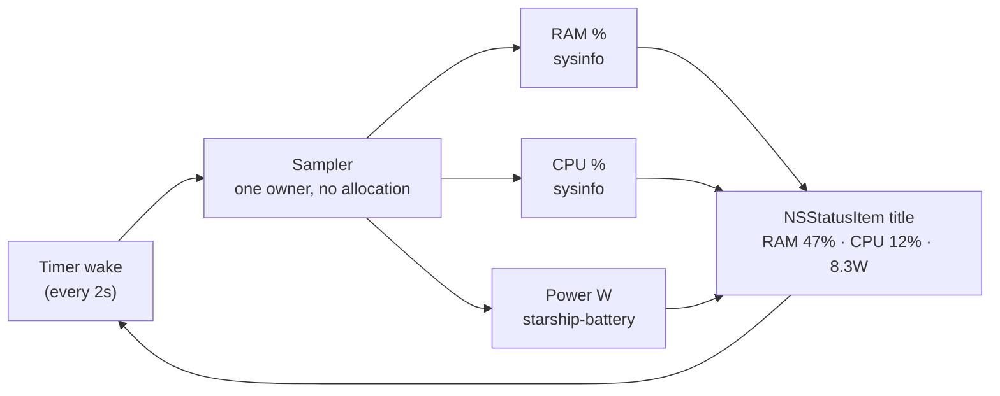

____
<br>

<div align="center">

# featherbar

**A featherweight macOS menu-bar system monitor that stays featherweight.**

</div>

A tiny, modular menu-bar (NSStatusItem) app in Rust that shows live stats as plain text in your menu bar:


Updates every 2 seconds. Right-click to quit. That's the whole app — and that's the point.

> **The premise.** Most menu-bar monitors slowly become what they measure: background threads, growing buffers, tens of MB of RSS. featherbar runs **zero background threads** and allocates **nothing that accumulates** — one main-thread event loop wakes on a timer, takes one sample, rewrites the title, and re-arms. Memory stays flat for as long as it runs.

## Features

- **Live stats in the menu bar**: RAM %, CPU %, and battery discharge watts, refreshed every 2s
- **No Dock icon, no window**: `ActivationPolicy::Accessory` — it exists only in the menu bar
- **No background threads**: a single main-thread `tao` event loop with `ControlFlow::WaitUntil` timer wakes
- **Launch at login toggle**: right-click menu check item backed by `SMAppService` (when running as the `.app` bundle)
- **Flat memory by design**: one `Sampler` owns all state; nothing grows, nothing leaks
- **Measured footprint**: ~16–19 MB (`phys_footprint`, the Activity Monitor number) on an M-series MacBook Pro — and it stays there
- **Modular metrics**: adding a stat is an enum variant + a match arm — nothing else changes
- **Tiny binary**: ~800 KB release build (`opt-level = "z"`, LTO, stripped)



___

<br>
<details>
  <summary>1. Requirements</summary>

- macOS on Apple Silicon (M-series)
- Rust **1.89+** (required by `starship-battery`)

</details>

<details>
  <summary>2. Installation</summary>

#### As an .app bundle (recommended — enables the launch-at-login toggle)

```bash
git clone https://github.com/nim444/featherbar.git
cd featherbar

# Build the release binary and assemble Featherbar.app (ad-hoc signed)
./scripts/bundle.sh
cp -R target/Featherbar.app /Applications/
open /Applications/Featherbar.app
```

#### As a bare binary

```bash
# From crates.io
cargo install featherbar
featherbar

# Or from a checkout
cargo run --release
```

The reading appears in your menu bar immediately. There is no Dock icon and no window — right-click the menu-bar text for the menu and **Quit**.

#### Launch at login

Right-click the menu-bar reading and check **Launch at login**. The toggle uses Apple's `SMAppService` API, which only works from a real `.app` bundle — from a bare `cargo run` binary the item is shown disabled. Verify the registration anytime in **System Settings → General → Login Items**.

</details>

<details>
  <summary>3. Project Structure</summary>

```
├── src/
│   ├── main.rs          # Metric enum, Sampler, event loop, menu
│   └── login_item.rs    # Launch-at-login via SMAppService
├── scripts/
│   └── bundle.sh        # Assemble Featherbar.app from the release binary
├── assets/
│   └── menubar.png
├── Cargo.toml           # 5 dependencies, size-optimized release profile
├── Cargo.lock
├── LICENSE              # Apache-2.0
└── README.md
```

Two source files on purpose. The app is small enough that splitting it up further would only add indirection.

</details>

<details>
  <summary>4. How It Works</summary>

The hard macOS constraints this design satisfies:

- The `tao` event loop must run on the **main thread**, and the tray icon must be created on that same thread.
- The tray icon is created **after the loop is running** — on `StartCause::Init`, not before.
- `ActivationPolicy::Accessory` keeps it out of the Dock and the app switcher.

The loop itself:

1. `StartCause::Init` — create the `TrayIcon` with the first reading, arm a 2s `ControlFlow::WaitUntil` timer.
2. `StartCause::ResumeTimeReached` — drain the menu-event channel (Quit?), take one sample per enabled metric, `set_title`, re-arm.
3. Nothing else. No threads, no channels to background workers, no history buffers.

A single `Sampler` struct owns the `sysinfo::System` and the battery manager, so per-tick work reuses the same state and RSS stays flat.

Measure it yourself while it runs (same metric Activity Monitor shows):

```bash
footprint $(pgrep -x featherbar)
# featherbar [pid]: 64-bit    Footprint: 16 MB
```

</details>

<details>
  <summary>5. Adding a Metric</summary>

Three edits, all in `src/main.rs`:

```rust
// 1. Add a variant
enum Metric {
    Ram,
    Cpu,
    Power,
    DiskFree, // new
}

// 2. Add a match arm in Sampler::fragment
Metric::DiskFree => {
    // sample, format, return a short String like "SSD 312G"
}

// 3. Enable it
const ENABLED: &[Metric] = &[Metric::Ram, Metric::Cpu, Metric::Power, Metric::DiskFree];
```

Good candidates with maintained crates and no reverse engineering: network up/down (`sysinfo` networks), disk free (`sysinfo` disks), battery % (`starship_battery`).

</details>

<details>
  <summary>6. Behavior Notes (not bugs)</summary>

- **Power reads `0.0W` on AC or at full charge.** The watt figure is the battery charge/discharge rate (`energy_rate`), so it is only meaningful while running on battery. It is NOT total system/SoC power.
- **Power may read `0.0W` for a minute right after unplugging.** The battery fuel gauge reports `InstantAmperage = 0` until real discharge current registers — featherbar shows exactly what the SMC reports. Verify the OS-side value with `ioreg -rn AppleSmartBattery | grep InstantAmperage`.
- **`—W` is shown** when no battery manager is available.
- **The first CPU sample may be off** for one tick until the second refresh lands.

</details>

<details>
  <summary>7. Scope — what featherbar will not do</summary>

Temperature, fans, and total SoC/package power are **out of scope**. They require undocumented IOKit/SMC keys that break with each new Apple Silicon generation — the exact maintenance treadmill this project exists to avoid. If you need those, [Stats](https://github.com/exelban/stats) does them well and pays that maintenance cost for you.

</details>

<details>
  <summary>8. Tech Stack</summary>

| Layer | Crate |
|---|---|
| Menu-bar icon (NSStatusItem) | `tray-icon` 0.21 |
| Main-thread event loop | `tao` 0.34 |
| RAM / CPU sampling | `sysinfo` 0.33 |
| Battery power draw | `starship-battery` 0.10 |

Release profile: `opt-level = "z"`, `lto = true`, `strip = true` → ~800 KB binary.

</details>

## Roadmap

- SMC `PSTR` (system total power) reader behind `Metric::Power`, with fallback to battery watts — total consumption with or without AC, accepting the undocumented-key tradeoff
- Network up/down and disk-free metrics
- A settings menu to toggle which metrics are shown at runtime

____
<br>

[](LICENSE)
